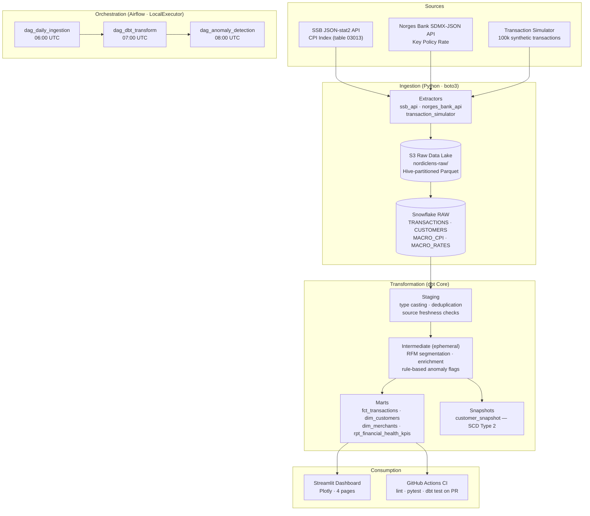

# NordicLens

Production-grade end-to-end ELT pipeline for Norwegian banking transaction analytics.

> Built to demonstrate modern data engineering practices in the Norwegian banking context —
> relevant to institutions like DNB, Nordea, and SpareBank 1.

---

## Architecture



---

## Tech Stack

| Layer | Technology |
|---|---|
| Language | Python 3.11 |
| Package manager | [uv](https://github.com/astral-sh/uv) |
| Data lake | AWS S3 (Hive-partitioned Parquet) |
| Warehouse | Snowflake (X-Small, auto-suspend) |
| Transformation | dbt Core 1.8 + dbt-snowflake |
| Orchestration | Apache Airflow 2.9 (Docker, LocalExecutor) |
| Statistical ML | scipy · scikit-learn (IsolationForest) |
| Dashboard | Streamlit + Plotly |
| CI/CD | GitHub Actions |
| Linter | Ruff |

---

## Data Sources

| Source | Format | Data |
|---|---|---|
| [Statistics Norway (SSB) table 03013](https://data.ssb.no/api/v0/en/table/03013) | JSON-stat2 | Monthly CPI (1998=100) |
| [Norges Bank SDMX-JSON](https://data.norges-bank.no/api/data/IR/B.KPRA.SD.) | SDMX-JSON | Key policy rate |
| `transaction_simulator.py` | Synthetic | 100,000 transactions (2023–2024), 5% fraud rate |

---

## Project Structure

```
nordiclens/
├── ingestion/
│   ├── extractors/
│   │   ├── ssb_api.py              # SSB JSON-stat2 CPI extractor
│   │   ├── norges_bank_api.py      # Norges Bank SDMX-JSON rate extractor
│   │   └── transaction_simulator.py # Synthetic PaySim-style generator
│   └── loaders/
│       ├── s3_uploader.py          # Hive-partitioned S3 upload, idempotent
│       └── snowflake_loader.py     # COPY INTO with MATCH_BY_COLUMN_NAME
├── dbt_project/
│   ├── models/
│   │   ├── staging/                # Type casting, deduplication, source tests
│   │   ├── intermediate/           # Ephemeral: RFM segments, enrichment, anomaly flags
│   │   └── marts/                  # fct_transactions, dim_*, rpt_financial_health_kpis
│   ├── snapshots/                  # customer_snapshot (SCD Type 2)
│   ├── macros/                     # generate_surrogate_key wrapper
│   ├── dbt_project.yml
│   └── packages.yml                # dbt-utils
├── airflow/
│   ├── dags/
│   │   ├── dag_daily_ingestion.py  # S3 → Snowflake COPY INTO
│   │   ├── dag_dbt_transform.py    # source freshness → run → test → snapshot → docs
│   │   └── dag_anomaly_detection.py # Z-score + IQR + IsolationForest → ANOMALY_DAILY_SUMMARY
│   ├── Dockerfile                  # Custom image: airflow:2.9.1 + project deps
│   ├── docker-compose.yml          # LocalExecutor + Postgres metadata DB
│   └── dbt_profiles/profiles.yml   # env_var() driven dbt profile for containers
├── dashboard/
│   └── app.py                      # 4-page Streamlit app (Plotly charts)
├── tests/
│   ├── test_ssb_api.py             # SSBCPIExtractor.parse() unit tests
│   ├── test_transaction_simulator.py # SimulatorConfig, amounts, anomaly injection
│   └── test_anomaly_logic.py       # IQR fences, Z-score groupby, IsolationForest
├── .github/workflows/
│   └── ci.yml                      # lint + pytest + dbt compile/test + PR comment
├── snowflake_setup.sql             # Full DDL: warehouse, roles, schemas, stage, tables
├── pyproject.toml                  # Single source of truth for deps (uv)
└── .env.example                    # Required environment variables
```

---

## Local Setup

### Prerequisites
- [uv](https://github.com/astral-sh/uv) (Python 3.11 managed automatically)
- Docker + Docker Compose
- Snowflake account (free trial works)
- AWS account with S3 access

### 1. Clone & install

```bash
git clone https://github.com/your-org/nordiclens.git
cd nordiclens

# Install uv if not already installed
curl -LsSf https://astral.sh/uv/install.sh | sh

# Create .venv with Python 3.11 and install all deps — one command
uv sync

# Prefix any command with `uv run` to use the venv without activating it
# e.g.  uv run python -m ingestion.extractors.ssb_api
```

### 2. Configure environment

```bash
cp .env.example .env
# Edit .env with your Snowflake, AWS, and Airflow credentials
```

Required variables:

| Variable | Description |
|---|---|
| `SNOWFLAKE_ACCOUNT` | Account identifier (e.g. `abc123.eu-west-1`) |
| `SNOWFLAKE_USER` | Snowflake username |
| `SNOWFLAKE_PASSWORD` | Snowflake password |
| `SNOWFLAKE_ROLE` | `NORDICLENS_ROLE` (created by setup SQL) |
| `SNOWFLAKE_WAREHOUSE` | `NORDICLENS_WH` |
| `SNOWFLAKE_DATABASE` | `NORDICLENS_DB` |
| `AWS_ACCESS_KEY_ID` | S3 write access |
| `AWS_SECRET_ACCESS_KEY` | S3 write access |
| `S3_BUCKET_NAME` | Target bucket (e.g. `nordiclens-raw`) |
| `AIRFLOW__CORE__FERNET_KEY` | Generate: `python -c "from cryptography.fernet import Fernet; print(Fernet.generate_key().decode())"` |

### 3. Set up Snowflake

```bash
# Run once in your Snowflake worksheet (or via SnowSQL)
snowsql -f snowflake_setup.sql
```

Creates: warehouse (X-Small, auto-suspend 120s), database, 5 schemas, roles, external S3 stage, Parquet file format, and 4 RAW tables.

### 4. Run ingestion

```bash
# Fetch SSB CPI data → data/raw/macro/ssb_cpi/cpi.parquet
uv run python -m ingestion.extractors.ssb_api

# Fetch Norges Bank policy rate → data/raw/macro/norges_bank/rates.parquet
uv run python -m ingestion.extractors.norges_bank_api

# Generate 100k synthetic transactions → data/raw/transactions/
uv run python -m ingestion.extractors.transaction_simulator

# Upload all Parquet to S3 and COPY INTO Snowflake
uv run python -m ingestion.loaders.s3_uploader
uv run python -m ingestion.loaders.snowflake_loader
```

### 5. Run dbt

```bash
cd dbt_project

# Install dbt packages (dbt-utils)
uv run dbt deps

# Check source freshness
uv run dbt source freshness

# Run all models
uv run dbt run

# Run tests across all layers
uv run dbt test

# Capture SCD Type 2 snapshot
uv run dbt snapshot

# Generate + serve docs
uv run dbt docs generate && uv run dbt docs serve
# Open http://localhost:8080
```

### 6. Start Airflow

```bash
cd airflow
docker compose up -d

# Create admin user (first run only)
docker compose exec airflow-webserver airflow users create \
  --username admin --firstname Admin --lastname User \
  --role Admin --email admin@nordiclens.no --password admin

# Open http://localhost:8080
```

DAG schedule:

| DAG | Schedule | Purpose |
|---|---|---|
| `nordiclens_daily_ingestion` | 06:00 UTC | S3 upload + Snowflake COPY INTO |
| `nordiclens_dbt_transform` | 07:00 UTC | dbt source freshness → run → test → snapshot → docs |
| `nordiclens_anomaly_detection` | 08:00 UTC | Statistical detection → ANOMALY_DAILY_SUMMARY |

### 7. Launch dashboard

```bash
uv run streamlit run dashboard/app.py
# Open http://localhost:8501
```

---

## dbt Lineage

```
RAW.TRANSACTIONS ──► stg_transactions ──► int_transactions_enriched ──► fct_transactions
RAW.CUSTOMERS    ──► stg_customers    ──► int_customer_segments     ──►  │
                                      ──► int_anomaly_flags         ──►  │
RAW.MACRO_CPI  ─┐                                                        │
RAW.MACRO_RATES ─┴► stg_macro_rates  ─────────────────────────────► rpt_financial_health_kpis
                                                                     dim_merchants
                                                                     customer_snapshot (SCD2)
```

All intermediate models are **ephemeral** — compiled inline into mart queries, never materialised as tables. This eliminates unnecessary intermediate table storage in Snowflake.

---

## Anomaly Detection

Two complementary layers of anomaly detection are applied daily:

### Layer 1 — Rule-based flags (dbt, `int_anomaly_flags`)

| Flag | Logic |
|---|---|
| `is_statistical_outlier` | Amount > mean + N·stddev within MCC category |
| `is_velocity_spike` | 3+ transactions within `velocity_window_minutes` |
| `is_large_round_amount` | Multiple of 1,000 NOK and > 50,000 NOK |
| `is_suspicious_late_night` | 00:00–04:59 and amount > 5,000 NOK |
| `is_unusual_geography` | Foreign transaction for `is_domestic_only` customer |

Thresholds are **dbt variables** (e.g. `anomaly_stddev_threshold`, `velocity_window_minutes`) — tunable per environment without code changes.

### Layer 2 — Statistical methods (Airflow, `dag_anomaly_detection`)

| Method | Scope | Implementation |
|---|---|---|
| Z-score | Per MCC category | `scipy.stats.zscore`, flags \|z\| > 3 |
| IQR fences | Per RFM segment | Non-parametric; flags outside [Q1 − 1.5·IQR, Q3 + 1.5·IQR] |
| Isolation Forest | Multivariate | `sklearn.ensemble.IsolationForest`; features: amount, hour, recency; contamination=5% |

Results are written to `MARTS.ANOMALY_DAILY_SUMMARY` via an idempotent DELETE + INSERT. Large DataFrames (up to 100k rows) are passed between Airflow tasks via **temp Parquet file** to avoid Airflow XCom size limits.

---

## CI/CD

Every pull request triggers `.github/workflows/ci.yml`:

```
lint (ruff check + format) ──► dbt-ci (compile + staging test + PR comment)
unit-tests (pytest)         ──►     │
                                    └── drop ephemeral CI_<PR#> Snowflake schema
```

- **Lint** (`ruff check` + `ruff format --check`) — fast code quality gate, ~10 seconds
- **Unit tests** (`pytest tests/`) — no external dependencies, covers SSB parser, simulator, anomaly logic
- **dbt compile** — validates all SQL compiles without errors
- **dbt test --select staging** — smoke test against an ephemeral `CI_<PR#>` Snowflake schema
- **PR comment** — posts pass/fail status + full output as a collapsible block
- **Schema cleanup** — `DROP SCHEMA IF EXISTS CI_<PR#> CASCADE` always runs, even on failure

Required GitHub repository secrets: `SNOWFLAKE_ACCOUNT`, `SNOWFLAKE_USER`, `SNOWFLAKE_PASSWORD`, `SNOWFLAKE_ROLE`, `SNOWFLAKE_WAREHOUSE`, `SNOWFLAKE_DATABASE`.

---

## Design Decisions

### Medallion Architecture (RAW → STAGING → INTERMEDIATE → MARTS)
Raw data is immutable; staging enforces types and rejects malformed rows; intermediate applies business logic; marts are query-optimised and clustered. This mirrors the approach used at major Nordic banks and provides clear data quality guarantees at each layer.

### SCD Type 2 for Customers
Customer segments and home cities change over time. A Type 2 dbt snapshot preserves full history, enabling accurate point-in-time analysis — e.g. "what RFM segment was this customer in at transaction time?" This is critical for regulatory audit trails under PSD2/GDPR.

### Rule-based + Statistical Anomaly Detection
Rule-based flags catch **known fraud patterns** with zero false-negative risk for those specific patterns. Statistical flags (Z-score, IQR, IsolationForest) catch **novel patterns** without labelled training data — essential in a real-world banking context where fraud patterns evolve continuously.

### dbt Variables for Thresholds
All anomaly thresholds are `var()` references in SQL, not hardcoded values. This enables stricter production thresholds vs. lenient development ones (`dbt run --vars '{"anomaly_stddev_threshold": 2.5}'`) without any code changes.

### uv as Package Manager
`uv` replaces pip + venv entirely. A single `uv sync` installs the exact locked environment from `pyproject.toml` in seconds — reproducible across local dev, CI, and Docker.

### Ephemeral Intermediate Models
dbt intermediate models are materialised as `ephemeral` — compiled inline into downstream queries. This avoids creating unnecessary intermediate tables in Snowflake, reducing storage cost and query planning complexity.

### XCom Parquet Pattern (Airflow)
The Airflow metadata DB has a ~1 MB XCom payload limit. Passing 100k-row DataFrames between tasks via a temp Parquet file sidesteps this limit while keeping task interfaces clean — only the file path (a small string) travels through XCom.
