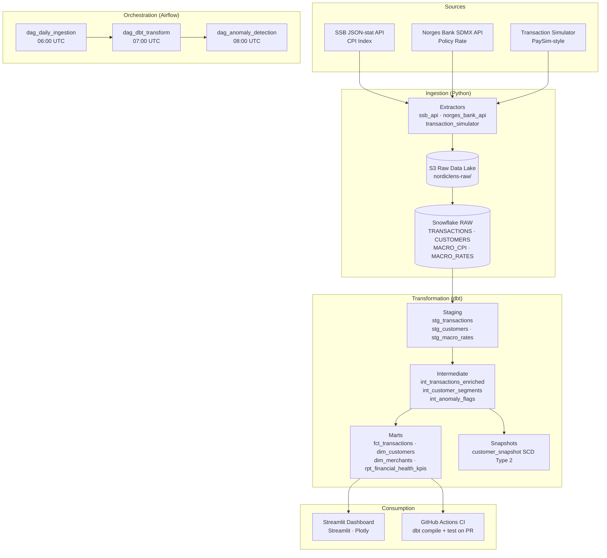

# NordicLens

Production-grade end-to-end ELT pipeline for Norwegian banking transaction analytics.

> Built to demonstrate modern data engineering practices in the Norwegian banking context —
> relevant to institutions like DNB, Nordea, and SpareBank 1.

---

## Architecture



---

## Data Sources

| Source | API | Data |
|--------|-----|------|
| Statistics Norway (SSB) | [JSON-stat API table 03013](https://data.ssb.no/api/v0/en/table/03013) | Monthly CPI |
| Norges Bank | [SDMX-JSON API](https://data.norges-bank.no/api/data/IR/B.KPRA.SD.) | Key policy rate |
| Synthetic | transaction_simulator.py | 100,000 transactions (2023–2024) |

---

## Local Setup

### Prerequisites
- Python 3.11+ (managed via [uv](https://github.com/astral-sh/uv))
- Docker + Docker Compose
- Snowflake account (free trial works)
- AWS account with S3 access

### 1. Clone & install

```bash
git clone https://github.com/your-org/nordiclens.git
cd nordiclens

# Install uv if not already installed
curl -LsSf https://astral.sh/uv/install.sh | sh

# Create .venv and install all deps from pyproject.toml in one step
uv sync

# For Airflow support (optional — heavy install, use Docker instead for local dev)
uv sync --extra airflow

# Activate the venv, or prefix any command with `uv run` to skip activation
source .venv/bin/activate
```

### 2. Configure environment

```bash
cp .env.example .env
# Edit .env with your Snowflake, AWS, and Airflow credentials
```

### 3. Set up Snowflake

```bash
# Run the setup script in your Snowflake worksheet
snowsql -f snowflake_setup.sql
```

### 4. Run ingestion

```bash
python -m ingestion.extractors.ssb_api
python -m ingestion.extractors.norges_bank_api
python -m ingestion.extractors.transaction_simulator
```

### 5. Configure dbt profile

```yaml
# ~/.dbt/profiles.yml
nordiclens:
  target: dev
  outputs:
    dev:
      type: snowflake
      account: "{{ env_var('SNOWFLAKE_ACCOUNT') }}"
      user: "{{ env_var('SNOWFLAKE_USER') }}"
      password: "{{ env_var('SNOWFLAKE_PASSWORD') }}"
      role: NORDICLENS_ROLE
      warehouse: NORDICLENS_WH
      database: NORDICLENS_DB
      schema: STAGING
      threads: 4
```

### 6. Run dbt

```bash
cd dbt_project
dbt deps
dbt run
dbt test
dbt snapshot
dbt docs generate && dbt docs serve
```

### 7. Start Airflow

```bash
cd airflow
docker compose up -d
# Open http://localhost:8080 (admin/admin)
```

### 8. Launch dashboard

```bash
streamlit run dashboard/app.py
# Open http://localhost:8501
```

---

## dbt Lineage

```
RAW.TRANSACTIONS ──► stg_transactions ──► int_transactions_enriched ──► fct_transactions
RAW.CUSTOMERS    ──► stg_customers    ──► int_customer_segments      ──► dim_customers
                                      ──► int_anomaly_flags          ──►  │
RAW.MACRO_CPI  ─┐                                                         │
RAW.MACRO_RATES ─┴► stg_macro_rates  ──────────────────────────────► rpt_financial_health_kpis
                                                                      dim_merchants
                                                                      customer_snapshot (SCD2)
```

---

## Design Decisions

### Medallion Architecture (RAW → STAGING → INTERMEDIATE → MARTS)
Provides clear data quality guarantees at each layer. Raw data is immutable;
staging enforces types; intermediate applies business logic; marts are optimised
for consumption. This mirrors the approach used at major Nordic banks.

### SCD Type 2 for Customers
Customer segments and locations change over time. A Type 2 snapshot preserves
the full history, enabling accurate point-in-time analysis (e.g. "what segment
was this customer in when they made this transaction?").

### Rule-based + Statistical Anomaly Detection
Rule-based flags (velocity, round amounts, geography) catch known fraud patterns
with zero false-negative risk for those specific patterns. Statistical flags
(z-score, IQR) catch novel patterns without needing labelled training data —
important in a real-world banking context where fraud patterns evolve.

### dbt Variables for Thresholds
Anomaly thresholds (`anomaly_stddev_threshold`, `velocity_window_minutes`, etc.)
are dbt variables rather than hardcoded SQL, enabling environment-specific tuning
without code changes (e.g. stricter thresholds in production).

---

## Dashboard Screenshot

> _Screenshots will be added after Phase 6 implementation._

---

## CI/CD

Every pull request triggers `.github/workflows/dbt_ci.yml`:
1. `dbt deps` — resolve packages
2. `dbt compile` — validate all SQL compiles cleanly
3. `dbt test --select staging` — fast smoke test against staging models
4. PR comment with test results (pass/fail + full output)
